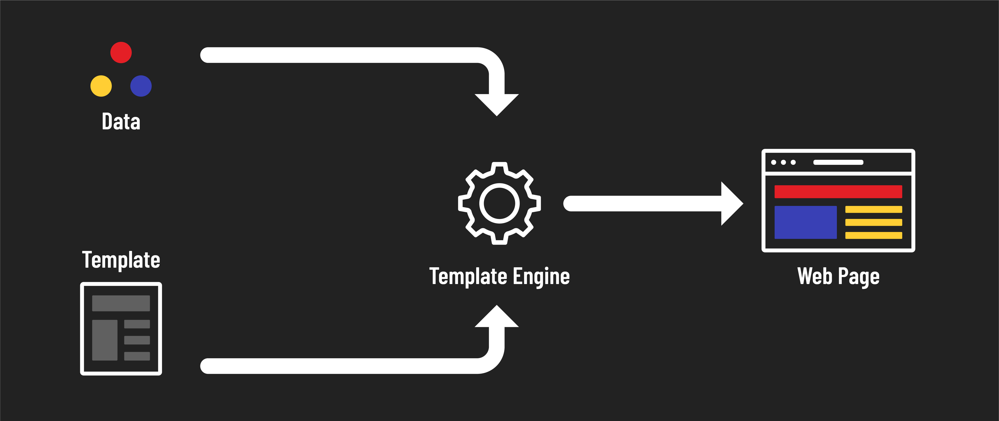

<h1>
  EJS
  Concepts
</h1>

**Learning objective:** By the end of this lesson, students will understand how EJS (Embedded JavaScript) is used in full-stack development with Node and Express.

## Templating for full-stack applications

Learning a templating tool like EJS is an important step in your full-stack development journey. Templates help bridge the gap between back-end logic and front-end presentation. This is because templates allow developers to generate HTML pages dynamically. If any data changes, users can immediately see those changes when they visit a page because the data itself hasn't been hard-coded into HTML.

For example, consider a social media platform like Facebook or Instagram. Every user sees their own personalized homepage showing their name, photos, and updates from friends. Instead of creating unique homepages for each user (an impractical approach), templates enable you to design a single layout with placeholders for each user's unique data.

## What is EJS?

[EJS](https://ejs.co/) is a templating tool that mixes regular HTML with JavaScript. It's not a framework or a language; it's a method to execute JavaScript within your HTML pages.

Returning to the social media site example from above:

> Instead of creating unique homepages for each user (an impractical approach), templates enable you to design a single layout with placeholders for each user's unique data.

EJS utilizes JavaScript to fill these placeholders with user-specific data. When a user visits the site, EJS on the server fills in the placeholders with personalized details. The server then sends the complete HTML page to the user's browser. This process enables the display of tailored information on the website without manually creating new pages for every change.

## Why learn EJS?

EJS is great for creating web applications like blogs or e-commerce sites that need content to change based on user interactions or data. It simplifies displaying this dynamic content on your web pages. Learning EJS increases your versatility as a full-stack developer, enabling you to build more complex and interactive web applications using JavaScript.

Because EJS embeds JavaScript directly into HTML, it is a natural choice for existing JavaScript developers to learn. Using JavaScript also makes it easier to manage the webpage's content dynamically, offering options for conditional rendering and complex page layouts.
