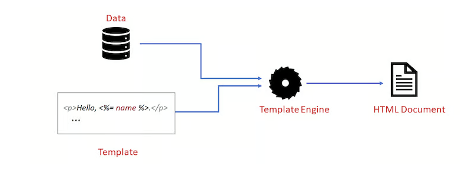

# 

**Learning objective:** By the end of this lesson, students will understand how EJS (Embedded JavaScript) is used in full-stack development with Node.js and Express.

## EJS: Templating for full-stack applications

EJS, or Embedded JavaScript, is a key stepping stone for students beginning to learn full-stack development with Node.js and Express. It's a valuable tool that bridges the gap between back-end logic and front-end presentation. With EJS, you get to blend HTML with JavaScript, creating web pages that dynamically respond to user interactions and data changes. EJS does this by weaving your data and logic into templates, transforming them into interactive HTML pages. 

## What is EJS?

EJS is a tool that makes it easy to mix regular HTML with JavaScript. This is especially handy when you want to create web pages that display different information each time they load. It's not a framework or a language on its own; think of it more as a method to execute JavaScript within your HTML pages. 

**For example**: 

Consider a social media platform like Facebook or Instagram. Here, every user experiences the same personalized homepage displaying their name, photos, and updates from friends. Instead of creating unique homepages for each user (an impractical approach), EJS enables you to design a single layout with placeholders for each user's unique data.

EJS then utilizes JavaScript for populating these placeholders with user-specific data. When a user visits the site, EJS on the server fills in these blanks with personalized details before sending the complete HTML page to the user's browser. This process enables the display of tailored information on the website without the need to manually create new pages for every change.

## Key Features of EJS

- **Dynamic page creation**: EJS excels in generating web pages that change based on user input or other data. It processes your webpage templates on the server and seamlessly integrates dynamic data, perfect for creating personalized user experiences.

- **Flexibility with JavaScript**: EJS allows you to embed JavaScript directly into your HTML. This makes it easier to manage the webpage's content dynamically, offering options for conditional rendering and complex page layouts.

## Why Learn EJS?

EJS is incredibly useful when creating web applications like blogs or e-commerce sites that need content to change based on user interactions or data. It simplifies displaying this dynamic content in your web pages. By learning EJS, you expand your capabilities in both server-side and frontend development. This skill increases your versatility as a full-stack developer, enabling you to build more complex and interactive web applications using JavaScript.

