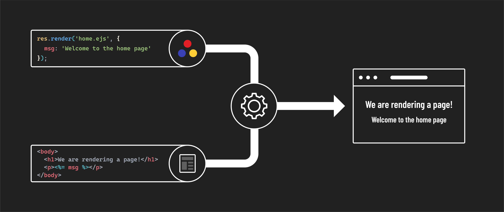

<h1>
  <span class="headline">EJS</span>
  <span class="subhead">The Locals Object</span>
</h1>

**Learning objective:** By the end of this lesson, students will understand how to pass data into EJS templates using the locals object.

## Passing data into templates

When using `res.render()` in Express, an optional object, known as the [*locals* object](http://expressjs.com/en/api.html#res.render), can be included as the second argument after the template that will be rendered. At its simplest, it looks like this:

```javascript
// server.js

app.get('/', (req, res) => {
  res.render('home.ejs', {});
});
```

> 📚 The *locals* object is how we get data into the template. Anything we put into this object will be available to use in the view.

This object defines variables accessible to the view being rendered. When you add a property to the object, the key will match the variable's name that you'll have access to in the EJS file, and the value is what that variable will hold. For example:

```javascript
// server.js

app.get('/', (req, res) => {
  res.render('home.ejs', { 
    msg: 'Welcome to the home page' 
  });
});
```

## Using data in views

We can now access the `msg` variable within `home.ejs`:

```html
<!-- views/home.ejs -->

<!DOCTYPE html>
<html lang="en">
  <head>
    <meta charset="UTF-8">
  <meta name="viewport" content="width=device-width, initial-scale=1.0">
  <title>Home</title>
</head>
<body>
  <h1>We are rendering a page!</h1>
  <p><%= msg %></p> 
</body>
</html>
```

Refresh the page in the browser, and you should see the "Welcome to the home page" text.



### Handling complex data structures

The locals object is versatile and can handle different data types, including arrays and objects.

Let's pass an object to the page and show the value of one of its properties:

```javascript
// server.js

app.get('/', (req, res) => {
  res.render('home.ejs', { 
    msg: 'Welcome to the home page' ,
    player: {
      name: "friend"
    }
  });
});
```

Feel free to update the value of the `player.name` property to something of your choosing. Now, let's access this in `home.ejs`:

```html
<!-- views/home.ejs -->

<!DOCTYPE html>
<html lang="en">
<head>
  <meta charset="UTF-8">
  <meta name="viewport" content="width=device-width, initial-scale=1.0">
  <title>Home</title>
</head>
<body>
  <h1>We are rendering a page!</h1>
  <p><%= msg %>, <%= player.name %>!</p> 
</body>
</html>
```

Refresh the page in the browser again, and you should see the "Welcome to the home page, friend!" text.

Next, let's pass an example array of objects representing an inventory of items. Note we'll also change the value of `msg`:

```javascript
// server.js

app.get('/', (req, res) => {
  res.render('home.ejs', { 
    msg: 'Here is your inventory',
    player: {
      name: "friend"
    },
    inventory: [
      { name: 'Candle', qty: 4 },
      { name: 'Cheese', qty: 10 },
      { name: 'Phone', qty: 1 },
      { name: 'Tent', qty: 0 },
      { name: 'Torch', qty: 5 }
    ]
  });
});
```

In your EJS file, loop through the `inventory` array to display each item:

```html
<!-- views/home.ejs -->

<!DOCTYPE html>
<html lang="en">
<head>
  <meta charset="UTF-8">
  <meta name="viewport" content="width=device-width, initial-scale=1.0">
  <title>Home</title>
</head>
<body>
  <h1>We are rendering a page!</h1>
  <p><%= msg %>, <%= player.name %>!</p> 
  <ul>
    <% inventory.forEach((item) => { %>
      <li><%= item.name %>: <%= item.qty %></li>
    <% }); %>
  </ul>
</body>
</html>
```

> 💡 The locals object is used to pass data to your EJS templates. It's the key to creating interactive and personalized web pages.
